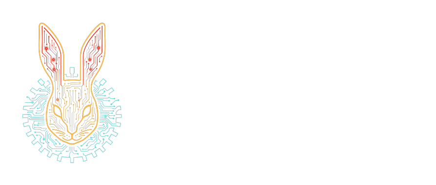

# kotlin-openai-schemas



<p align=center>
    
    
</p>

`kotlin-openai-schemas` is a Kotlin Multiplatform helper library for deriving OpenAI function-tool
schemas from `kotlinx.serialization` descriptors.

It is designed for applications that model tool calls as typed Kotlin request classes and want the
same model to produce OpenAI SDK `Tool` declarations and decode model `FunctionCall` values.

## 🚀 Installation

```kotlin
repositories {
    mavenCentral()
}

dependencies {
    implementation("one.wabbit:kotlin-openai-schemas:0.1.0")
}
```

The library depends on `kotlinx.serialization`, `one.wabbit:kotlin-data-ref`, and the Aallam
OpenAI Kotlin SDK types used for chat tools.

## 🚀 Usage

```kotlin
import kotlinx.serialization.SerialName
import kotlinx.serialization.Serializable
import one.wabbit.openaischemas.FunctionSchema
import one.wabbit.openaischemas.FunctionSchema.Doc

@Serializable
sealed interface ToolRequest {
    @Doc("Generate a meme given a template and text.")
    @SerialName("GenerateMeme")
    @Serializable
    data class GenerateMeme(
        @Doc("The name of the meme template.")
        val templateName: String,
        @Doc("The text to put in each meme box.")
        val boxText: List<String>,
    ) : ToolRequest
}

val tools = FunctionSchema.makeFunctions(ToolRequest.serializer().descriptor)

check(tools.single().compiledToolSchema.function.name == "GenerateMeme")
```

Each sealed subtype becomes one OpenAI function tool. Use `@SerialName` values without package dots,
because subtype names become OpenAI function names.

## Decoding Function Calls

```kotlin
import kotlinx.serialization.json.JsonObject
import kotlinx.serialization.json.JsonPrimitive
import kotlinx.serialization.json.JsonArray

val request = FunctionSchema.parseFunctionCall(
    serializer = ToolRequest.serializer(),
    name = "GenerateMeme",
    arguments = JsonObject(
        mapOf(
            "templateName" to JsonPrimitive("classic"),
            "boxText" to JsonArray(listOf(JsonPrimitive("top"), JsonPrimitive("bottom"))),
        )
    ),
)

check(request is ToolRequest.GenerateMeme)
```

`parseFunctionCall` injects the function name as the sealed `"type"` discriminator before decoding
with `kotlinx.serialization`.

## Schema Model

`FunctionSchema.TypeDef` is an intermediate schema tree derived from `SerialDescriptor` values. It
supports primitive values, enums, lists, maps, inline/value-class aliases, objects, nullable fields,
and sealed request hierarchies.

For OpenAI function parameters, nullable object fields are omitted from the generated `required`
list. The current JSON Schema lowering does not emit an explicit `"null"` union for nullable field
types.

## Status

This library is early and intentionally narrow. It is useful for typed sealed request hierarchies,
but it is not a complete JSON Schema generator. Open polymorphism, contextual serializers, and
direct sealed-type JSON Schema lowering are not currently implemented.

## Documentation

- [User guide](docs/user-guide.md)
- [API reference notes](docs/api-reference.md)
- [Troubleshooting](docs/troubleshooting.md)
- [Development](docs/development.md)

Generated API docs can be built locally with Dokka. See [API reference notes](docs/api-reference.md)
for the command.

## Release Notes

- [CHANGELOG.md](CHANGELOG.md)

## Licensing

This project is licensed under the GNU Affero General Public License v3.0 (AGPL-3.0) for open
source use.

For commercial use, contact Wabbit Consulting Corporation at `wabbit@wabbit.one`.

## Contributing

Before contributions can be merged, contributors need to agree to the repository CLA.
